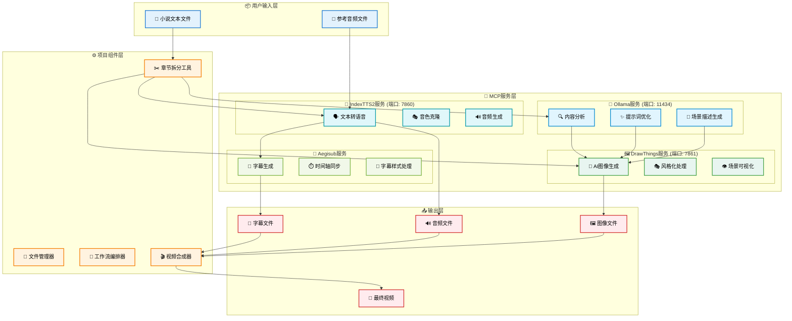

# MCP (Model Context Protocol) 服务架构说明

## 1. 整体架构概述

本项目采用MCP协议集成多个AI服务，形成完整的小说转视频工作流。整体架构如下：

```mermaid
graph TB
    subgraph "📦 用户输入层"
        A[📖 小说文本文件]
        B[🎵 参考音频文件]
    end
    
    subgraph "🤖 MCP服务层"
        subgraph "🧠 Ollama服务 (端口: 11434)"
            O1[🔍 内容分析]
            O2[✨ 提示词优化]
            O3[📝 场景描述生成]
        end
        
        subgraph "💬 IndexTTS2服务 (端口: 7860)"
            T1[🗣️ 文本转语音]
            T2[🎭 音色克隆]
            T3[🔊 音频生成]
        end
        
        subgraph "🖼️ DrawThings服务 (端口: 7861)"
            D1[🎨 AI图像生成]
            D2[🎭 风格化处理]
            D3[👁️ 场景可视化]
        end
        
        subgraph "📝 Aegisub服务"
            S1[💬 字幕生成]
            S2[⏱️ 时间轴同步]
            S3[🎨 字幕样式处理]
        end
    end
    
    subgraph "⚙️ 项目组件层"
        P1[✂️ 章节拆分工具]
        P2[📁 文件管理器]
        P3[🔄 工作流编排器]
        P4[🎬 视频合成器]
    end
    
    subgraph "📤 输出层"
        OUT1[🔊 音频文件]
        OUT2[🖼️ 图像文件]
        OUT3[📝 字幕文件]
        OUT4[🎥 最终视频]
    end

    A --> P1
    B --> T1
    P1 --> O1
    P1 --> T1
    P1 --> D1
    
    O1 --> D1
    O2 --> D1
    O3 --> D1
    
    T1 --> OUT1
    D1 --> OUT2
    T1 --> S1
    S1 --> OUT3
    
    OUT1 --> P4
    OUT2 --> P4
    OUT3 --> P4
    P4 --> OUT4
    
    %% 颜色定义
    classDef inputClass fill:#e3f2fd,stroke:#1976d2,stroke-width:2px,color:#000
    classDef mcpClass fill:#f3e5f5,stroke:#7b1fa2,stroke-width:2px,color:#000
    classDef serviceClass fill:#e8f5e8,stroke:#388e3c,stroke-width:2px,color:#000
    classDef componentClass fill:#fff3e0,stroke:#f57c00,stroke-width:2px,color:#000
    classDef outputClass fill:#ffebee,stroke:#d32f2f,stroke-width:2px,color:#000
    classDef olamaClass fill:#e1f5fe,stroke:#0288d1,stroke-width:2px,color:#000
    classDef indexttsClass fill:#e0f7fa,stroke:#0097a7,stroke-width:2px,color:#000
    classDef drawthingsClass fill:#e8f5f0,stroke:#43a047,stroke-width:2px,color:#000
    classDef aegisubClass fill:#f1f8e9,stroke:#7cb342,stroke-width:2px,color:#000

    %% 应用颜色类
    class A,B inputClass
    class O1,O2,O3 olamaClass
    class T1,T2,T3 indexttsClass
    class D1,D2,D3 drawthingsClass
    class S1,S2,S3 aegisubClass
    class P1,P2,P3,P4 componentClass
    class OUT1,OUT2,OUT3,OUT4 outputClass
```