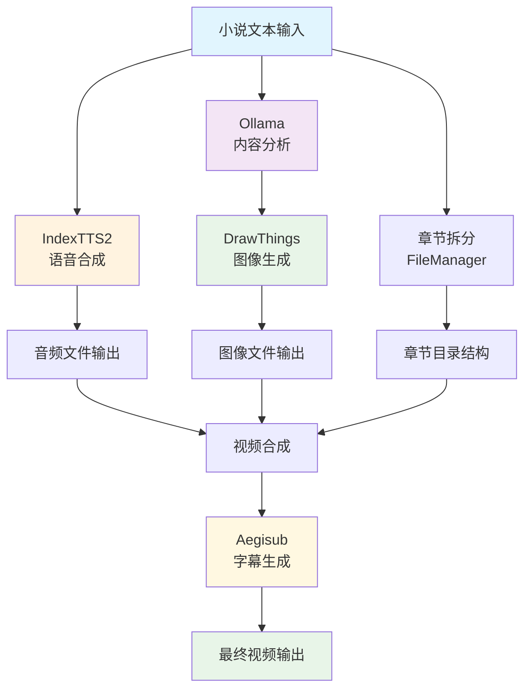

# 小说视频工作流项目详细说明文档

## 1. 硬件配置要求

### 1.1 主要硬件配置
- **设备型号**: Mac Studio M2 Max 基础款
- **CPU**: Apple M2 Max
- **内存**: 基础款配置
- **存储**: 根据项目规模需求配置

### 1.2 必需软件
- **FFmpeg**: 用于音视频处理
  - 安装方式: `brew install ffmpeg`
  - 功能: 音频编码、视频合成、格式转换

## 2. MCP (Model Context Protocol) 服务配置

### 2.1 Aegisub 字幕生成服务
- **端口号**: 无特定端口（本地脚本）
- **功能**: 自动生成和处理字幕文件
- **用途**: 将文本内容转换为ASS格式字幕，支持样式定制
- **配置文件**: `config.yaml` 中的 `subtitle` 部分

### 2.2 IndexTTS2 语音合成服务
- **端口号**: 7860
- **功能**: 文本转语音服务
- **用途**: 将小说章节文本转换为高质量语音
- **配置示例**:
  ```yaml
  tts:
    indextts2:
      api_url: "http://localhost:7860"
      timeout_seconds: 300
      max_retries: 3
  ```

### 2.3 DrawThings 图像生成服务
- **端口号**: 7861
- **功能**: AI图像生成服务
- **用途**: 根据小说内容生成对应场景图像
- **配置示例**:
  ```yaml
  image:
    engine: "drawthings"
    drawthings_model: "dreamshaper_8.safetensors"
    drawthings_scheduler: "DPM++ 2M Karras"
  ```

### 2.4 Ollama 语言模型服务
- **端口号**: 11434
- **功能**: 本地大语言模型服务
- **用途**: 内容分析、提示词优化、场景生成
- **主要模型**:
  - `llama3:8b` - 通用文本处理
  - `llava:13b` - 图像分析（如有需要）
- **API端点**: `http://localhost:11434/api/tags`

## 3. 各MCP服务在项目中的功能

### 3.1 IndexTTS2 - 语音合成
- 将小说章节文本转换为自然语音
- 支持参考音频的音色克隆
- 提供高质量的语音输出
- 集成到音频生成工作流中

### 3.2 DrawThings - 图像生成
- 分析章节内容并生成对应视觉场景
- 支持风格化图像生成
- 与Ollama结合进行智能提示词优化
- 生成适合视频制作的图像素材

### 3.3 Aegisub - 字幕处理
- 从音频和文本生成同步字幕
- 支持多种字幕格式和样式
- 自动时间轴对齐
- 提供专业级字幕编辑功能

### 3.4 Ollama - 内容智能分析
- 章节内容理解和摘要
- 场景描述和提示词优化
- 文本风格分析
- 智能分镜建议

## 4. 项目架构图



## 5. MCP服务运行机理

### 5.1 工作流程顺序
1. **文本预处理**: 读取小说文件，进行章节拆分
2. **内容分析**: 使用Ollama分析章节内容
3. **语音生成**: 通过IndexTTS2生成对应语音
4. **图像生成**: 结合Ollama分析结果，使用DrawThings生成图像
5. **字幕生成**: 通过Aegisub生成同步字幕
6. **视频合成**: 将音频、图像、字幕合成最终视频

### 5.2 数据流向
```
输入小说文本
    ↓
章节拆分与目录创建
    ↓
Ollama内容分析
    ↓
IndexTTS2语音合成
    ↓
DrawThings图像生成
    ↓
Aegisub字幕生成
    ↓
视频合成输出
```

## 6. 各MCP服务测试过程

### 6.1 IndexTTS2 测试
- **测试位置**: `cmd/test_workflow/main.go`
- **测试内容**:
  - 验证API连接状态
  - 测试文本转语音功能
  - 检查音频质量与格式

### 6.2 DrawThings 测试
- **测试位置**: `pkg/tools/drawthings/client.go`
- **测试内容**:
  - 验证API可用性
  - 测试图像生成质量
  - 检查提示词优化功能

### 6.3 Ollama 测试
- **测试位置**: `pkg/tools/drawthings/ollama_client.go`
- **测试内容**:
  - 验证模型服务状态
  - 测试内容分析能力
  - 检查提示词生成质量

### 6.4 Aegisub 测试
- **测试位置**: `pkg/tools/aegisub/aegisub_generator.go`
- **测试内容**:
  - 验证脚本可用性
  - 测试字幕同步准确性
  - 检查字幕格式与样式

## 7. 配置文件(config.yaml)详解

```yaml
# 路径配置
paths:
  base_dir: "~/NovelVideos"          # 基础工作目录
  novel_source: "~/Documents/Novels" # 小说源文件目录
  reference_audio: "~/reference_audio.wav" # 参考音频路径
  output_template: "chapter_{chapter:02d}"  # 输出模板

# TTS配置
tts:
  engine: "indexTTS"                 # TTS引擎选择
  indextts2:                         # IndexTTS2配置
    api_url: "http://localhost:7860" # API地址
    timeout_seconds: 300             # 超时时间
    max_retries: 3                   # 最大重试次数

# 图片生成配置
image:
  engine: "drawthings"               # 图像生成引擎
  width: 768                         # 输出宽度
  height: 512                        # 输出高度
  drawthings_model: "dreamshaper_8.safetensors" # 模型选择

# 视频处理配置
video:
  resolution:
    width: 1920                      # 视频宽度
    height: 1080                     # 视频高度
  frame_rate: 30                     # 帧率
  subtitle:                          # 字幕配置
    font_size: 48                    # 字体大小
    font_color: "#FFFFFF"            # 字体颜色
```

## 8. 启动和运行说明

### 8.1 启动MCP服务
1. 启动Ollama: `ollama serve`
2. 启动IndexTTS2: `cd indexTTS2 && python app.py`
3. 启动DrawThings: `cd stable-diffusion-webui && ./webui.sh`
4. 确认Aegisub已安装

### 8.2 运行项目
- 主工作流: `go run cmd/test_workflow/main.go`
- 章节拆分: `go run cmd/split_chapters/main.go`
- 端到端测试: `go run cmd/full_workflow/main.go`