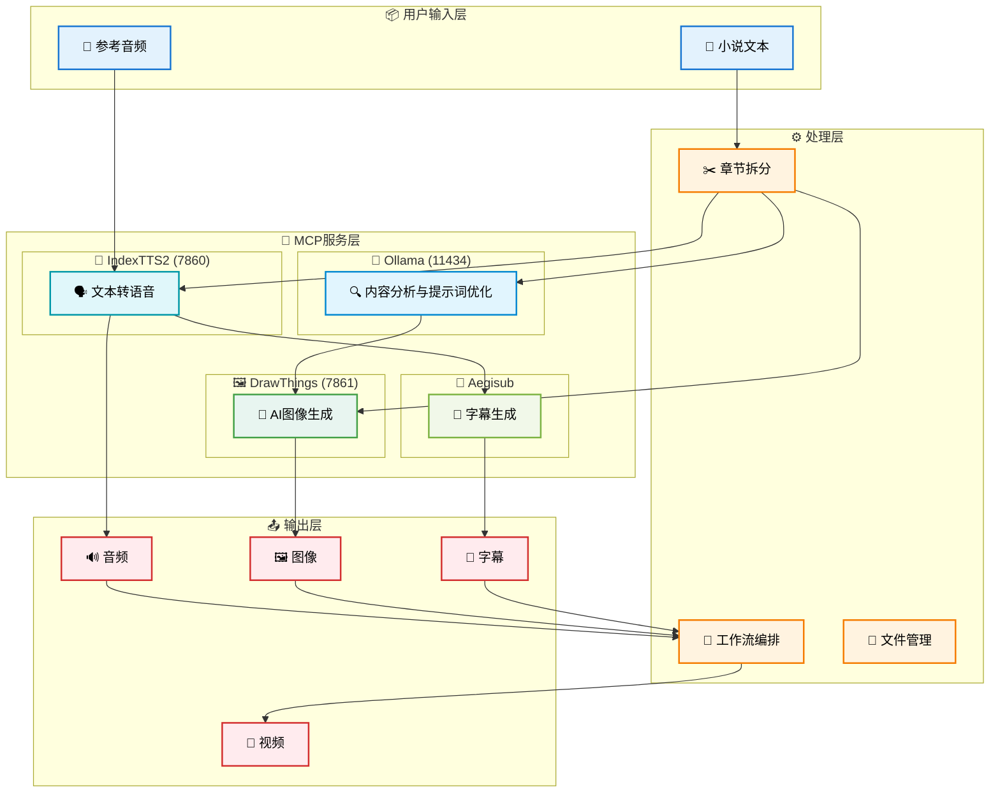

<p align="center">
 
</p>


# Novel Video Workflow  

这是一个自动化的小说视频生成MCP工作流，能够将文本小说转换为带有音频、字幕和图像的视频内容。

## MCP服务架构图



## 功能特性

- 智能章节分割
- AI驱动的文本转语音
- 自动生成字幕/台词
- AI图像生成
- 自动化工作流程管理
- MCP（Model Context Protocol）服务集成

## 工作流程

1. 从 `input` 目录读取小说文本
2. 智能分章节功能将小说拆分为多个章节
3. 对每个章节依次执行：
   - 音频生成（使用参考音频进行TTS）
   - 台词/字幕生成（基于音频和文本）
   - 图像生成（使用AI模型生成匹配图像）
4. 所有输出文件按章节分别存储

## 目录结构

处理后的文件将按以下结构组织：

```
output/
└── 小说名称/
    └── chapter_01/
        ├── chapter_01.wav      # 音频文件
        ├── chapter_01.srt      # 字幕文件
        └── images/             # 图像目录
            ├── scene_01.png
            ├── scene_02.png
            └── ...
```

输入目录结构：
```
input/
└── 小说名称/
    └── chapter_01/
        └── chapter_01.txt
```

## MCP 服务集成

本项目实现了MCP（Model Context Protocol）协议，支持以下服务：

### 1. IndexTTS2 服务
- **端口**: `http://localhost:7860`
- **功能**: 高质量语音合成，支持声音克隆
- **依赖**: 参考音频文件 `./assets/ref_audio/ref.m4a`

### 2. DrawThings 服务
- **端口**: `http://localhost:7861`
- **功能**: AI图像生成，基于Stable Diffusion
- **模型**: `dreamshaper_8.safetensors`

### 3. Ollama 服务
- **端口**: `http://localhost:11434`
- **功能**: 大语言模型推理，用于提示词生成和内容分析
- **模型**: `llama3:8b`

### 4. Aegisub 服务
- **功能**: 字幕生成与时间轴匹配
- **依赖**: Aegisub应用及脚本


## 依赖项

- Go 1.19+
- IndexTTS2 - 用于文本转语音
- Stable Diffusion (via DrawThings) - 用于图像生成
- Aegisub - 用于字幕生成
- Ollama - 用于AI推理
- FFmpeg - 用于音频处理

## 章节编号处理

- 支持阿拉伯数字和中文数字识别（如"第七章"或"第7章"）
- 输出使用两位数格式（如 `chapter_01`, `chapter_07`）
- 最多支持99章处理
- 自动检测重复内容并跳过处理

## 使用方法

1. 将小说文本文件放入 `input` 目录，按以下结构组织：
   ```
   input/
   └── 你的小说名称/
       └── 你的小说名称.txt  # 或者已拆分的 chapter_01 等目录
   ```

2. 启动所需服务：
   ```bash
   # 启动 Ollama
   ollama serve
   
   # 启动 Stable Diffusion WebUI (DrawThings)
   cd /path/to/stable-diffusion-webui && ./webui.sh --port 7861
   
   # 启动 IndexTTS2
   cd /path/to/index-tts && python app.py --port 7860
   ```

3. 运行测试工作流程：
   ```bash
   go run cmd/test_workflow/main.go
   ```

## 服务自检

程序启动时会自动检查所有必需服务的可用性：
- Ollama 服务 - 必需
- DrawThings 服务 - 必需  
- IndexTTS2 服务 - 必需
- Aegisub 脚本 - 必需

如果任一关键服务不可用，程序将停止执行。

## 输出文件

- **音频文件**: `chapter_01.wav` (高质量音频)
- **字幕文件**: `chapter_01.srt` (SRT格式)
- **图像文件**: `scene_01.png`, `scene_02.png`... (AI生成图像)

## 详细配置参考

更多信息请参考以下文档：
- [MCP_SERVICES_GUIDE.md](MCP_SERVICES_GUIDE.md) - 详细的服务配置和使用说明
- [PROJECT_DOCUMENTATION.md](PROJECT_DOCUMENTATION.md) - 完整项目说明文档
- [MCP_ARCHITECTURE.md](MCP_ARCHITECTURE.md) - MCP服务架构详解
- [FULL_USER_GUIDE.md](FULL_USER_GUIDE.md) - 完整用户指南


## 成果展示（output目录)

### 智能分镜 


### 音频文件  

[chapter_07.wav](output/%E5%B9%BD%E7%81%B5%E5%AE%A2%E6%A0%88/chapter_07/chapter_07.wav)

### 台词文件  

[chapter_07.srt](output/%E5%B9%BD%E7%81%B5%E5%AE%A2%E6%A0%88/chapter_07/chapter_07.srt)


最后，祝君 事业成功！