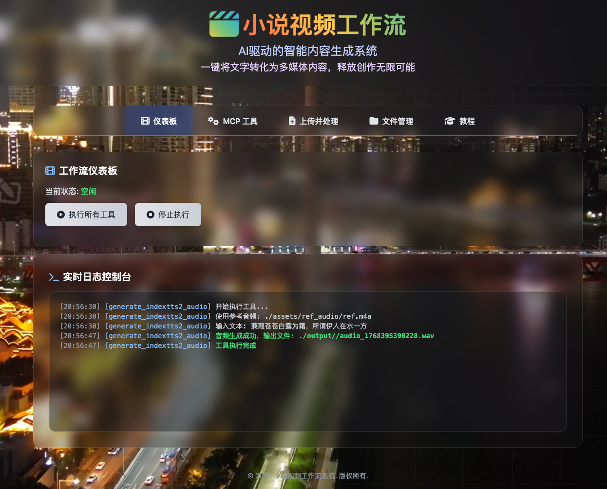
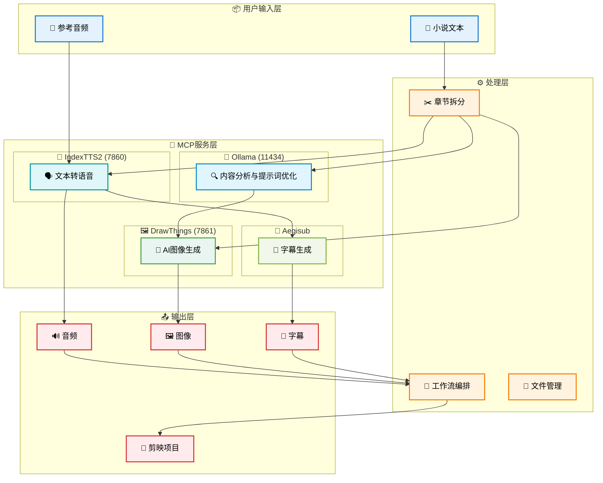

<p align="center">
 
</p>

<p align="center">
特别说明  
剪映客户端版本 3.4.1 其他版本可自行尝试 
下载链接：https://www.alipan.com/s/PDnHQbukWjj
</p>

# 小说视频工作流 (Novel Video Workflow)

一个基于AI技术的小说转视频自动化生成系统，集成了多种AI工具（TTS、图像生成等），能够将小说文本转换为带有音频、字幕和图像的视频内容，并生成可用于剪映的一键出片项目结构。

## 🌟 功能特性

- ✨ **智能章节分割** - 自动将小说文本按章节拆分
- 🗣️ **AI驱动文本转语音** - 支持声音克隆的高质量语音合成
- 💬 **自动生成字幕** - 基于音频内容的精准时间轴字幕
- 🎨 **AI图像生成** - 基于章节内容的智能图像生成
- ⚙️ **自动化工作流** - 端到端的自动化处理流程
- 🔌 **MCP服务集成** - 与Ollama Desktop等AI代理平台集成
- 🌐 **Web控制台界面** - 直观易用的Web操作界面
- 🎬 **剪映项目导出** - 生成可直接导入剪映的项目结构

## 🖥️ Web控制台



## 🏗️ MCP服务架构图



## 🚀 快速开始

### 系统要求（项目测试,后期扩展到更多平台）

- **操作系统**: macOS
- **Go**: 1.25+ (推荐)
- **内存**: 16GB以上 (推荐32GB)
- **GPU**: Apple Silicon (Metal支持)
- **存储**: 100GB以上可用空间

### 依赖服务

在运行系统前，请确保以下服务已安装并运行：

1. **Ollama** (用于AI推理)
   ```bash
   # 安装Ollama
   curl -fsSL https://ollama.ai/install.sh | sh
   # 启动服务
   ollama serve
   # 下载模型
   ollama pull qwen3:4b
   ```

2. **Drawthings** (用于图像生成)  
苹果商店下载，开启http访问，7861端口


3. **IndexTTS2** (用于TTS语音合成)
   ```bash
   # 按照IndexTTS2项目说明安装并启动服务
   # 确保服务在 http://localhost:7860 运行
   ```

### 启动步骤

1. **准备输入文件**
   ```bash
   # 将小说文件放入input目录
   mkdir -p input/小说名称
   cp 你的小说.txt input/小说名称/小说名称.txt
   ```

2. **准备参考音频** (可选但推荐)
   ```bash
   # 将参考音频文件放入assets目录
   mkdir -p assets/ref_audio
   cp 你的参考音频.m4a assets/ref_audio/ref.m4a
   ```

3. **启动系统**
   ```bash
   # 方法1: 同时启动MCP和Web服务 (推荐，默认)
   go run main.go

   # 方法2: 仅启动MCP服务
   go run main.go mcp

   # 方法3: 仅启动Web服务
   go run main.go web

   # 方法4: 批量处理模式
   go run main.go batch
   ```

4. **访问Web界面**
   - 打开浏览器访问: http://localhost:8080
   - 上传小说文件并开始处理

## 🛠️ 使用方法

### 1. Web界面操作

1. 访问 `http://localhost:8080`
2. 上传小说文件夹至input目录
3. 选择需要处理的工具（章节分割、音频生成、图像生成等）
4. 点击"处理上传的文件夹"执行完整工作流
5. 查看output目录中的生成结果

### 2. MCP服务调用

系统支持通过MCP协议调用各种工具，适用于AI代理集成：

```bash
# 启动MCP服务
MCP_STDIO_MODE=true go run main.go

# 或使用桥接器
go run cmd/ollama_mcp_bridge/main.go -mode server
```

### 3. 命令行批量处理

```bash
go run cmd/full_workflow/main.go
```

### 4. 一键生成剪映草稿，修改后直接发布  
在output目录下，选择chapter_0x章节，点击一键发布，打开剪映，便可以看到草稿文件，文件名与章节名一致  

## 📁 目录结构

### 输入目录结构
```
input/
└── 小说名称/
    └── 小说名称.txt  # 或已拆分的 chapter_01 等目录
```

### 输出目录结构
```
output/
└── 小说名称/
    └── chapter_01/
        ├── chapter_01.wav      # 音频文件
        ├── chapter_01.srt      # 字幕文件
        ├── chapter_01.json     # 剪映项目文件
        └── images/             # 图像目录
            ├── scene_01.png
            ├── scene_02.png
            └── ...
    └── chapter_02/
        ├── chapter_02.wav
        ├── chapter_02.srt
        ├── chapter_02.json
        └── images/
            ├── scene_01.png
            ├── scene_02.png
            └── ...
```

## 🔧 主要工具列表

系统提供以下MCP工具供调用：

| 工具名称 | 功能描述 |
|---------|----------|
| `generate_indextts2_audio` | 使用IndexTTS2生成音频 |
| `generate_subtitles_from_indextts2` | 生成字幕文件 |
| `file_split_novel_into_chapters` | 分割小说章节 |
| `generate_image_from_text` | 根据文本生成图像 |
| `generate_image_from_image` | 图像风格转换 |
| `generate_images_from_chapter` | 章节转图像 |
| `generate_images_from_chapter_with_ai_prompt` | AI智能提示词图像生成 |

## ⚙️ 配置说明

系统通过 `config.yaml` 文件进行配置，主要配置项包括：

- **服务端点**: Ollama, Stable Diffusion, IndexTTS2等服务地址
- **路径配置**: 输入输出目录、资源文件路径
- **图像设置**: 生成图像的尺寸、质量、样式等
- **音频设置**: 音频格式、采样率等
- **工作流设置**: 并发任务数、临时目录等

## 🧩 MCP服务集成

本项目实现了MCP（Model Context Protocol）协议，支持以下集成方式：

### 1. Ollama Desktop集成
- 通过MCP协议与Ollama Desktop无缝集成
- 提供丰富的工具集合供AI代理调用

### 2. 工具处理器
- 使用 [ollama_tool_processor.go](pkg/utils/ollama_tool_processor.go) 作为代理
- 将外部工具调用转发到本地MCP服务

### 3. MCP桥接器
- 通过 [cmd/ollama_mcp_bridge/main.go](cmd/ollama_mcp_bridge/main.go) 提供额外集成选项
- 支持多种运行模式

## 📋 依赖项

- **Go**: 1.25+
- **Ollama**: 用于AI推理
- **Drawthings**: 用于图像生成
- **IndexTTS2**: 用于高质量语音合成
- **Aegisub**: 用于字幕生成
- **FFmpeg**: 用于音频处理

## 🧪 章节编号处理

- 支持阿拉伯数字和中文数字识别（如"第七章"或"第7章"）
- 输出使用两位数格式（如 `chapter_01`, `chapter_07`）
- 最多支持99章处理
- 自动检测重复内容并跳过处理

## 🔍 服务自检

程序启动时会自动检查所有必需服务的可用性：
- Ollama 服务 - 必需
- DrawThings 服务 - 必需  
- IndexTTS2 服务 - 必需
- Aegisub 脚本 - 必需

如果任一关键服务不可用，程序将停止执行并显示错误信息。

## 📁 输出文件

- **音频文件**: `chapter_01.wav` (高质量音频)
- **字幕文件**: `chapter_01.srt` (SRT格式)
- **图像文件**: `scene_01.png`, `scene_02.png`... (AI生成图像)
- **剪映项目**: `chapter_01.json` (可直接导入剪映的项目文件，或作为剪映配置文件的参考)

## 📚 详细文档

更多信息请参考以下文档：

- [SYSTEM_ARCHITECTURE.md](SYSTEM_ARCHITECTURE.md) - 系统架构详细说明
- [USER_GUIDE.md](USER_GUIDE.md) - 完整用户操作手册
- [pkg/tools/drawthings/README.md](pkg/tools/drawthings/README.md) - 图像生成模块说明


## 💻 剪映截图   一键到剪映，自动生成到剪映的草稿目录，无需人工导入 


## 🎬 效果一览 
[chapter_10.srt](output/%E5%B9%BD%E7%81%B5%E5%AE%A2%E6%A0%88/chapter_10/chapter_10.srt)
[chapter_10.wav](output/%E5%B9%BD%E7%81%B5%E5%AE%A2%E6%A0%88/chapter_10/chapter_10.wav)


## 🤝 贡献

欢迎提交Issue和Pull Request来帮助改进项目！

## 📄 许可证

本项目采用 MIT 许可证 - 查看 [LICENSE](LICENSE) 文件了解详情